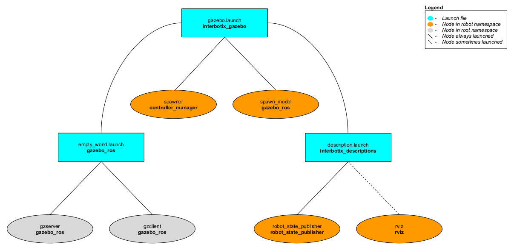

# interbotix_gazebo

## Overview
This package contains the necessary config files to get any of the many Interbotix X-Series arms working in Gazebo. Specifically, it contains the [interbotix_texture.gazebo](config/interbotix_texture.gazebo) file which allows the black texture of the robotic arms to display properly (following the method explained [here](http://answers.gazebosim.org/question/16280/how-to-use-custom-textures-on-urdf-models-in-gazebo/)). It also contains YAML files with tuned PID gains for the arm and gripper joints so that ros_control can control the arms effectively. This package is meant to be used in conjunction with MoveIt via the FollowJointTrajectory interface.

## Structure

As shown above, the *interbotix_gazebo* package builds on top of the *interbotix_descriptions* and *gazebo_ros* packages. To get familiar with the nodes in the *interbotix_descriptions* package, please look at its README. The other nodes are described below:
- **gzserver** - responsible for running the physics update-loop and sensor data generation
- **gzclient** - provides a nice GUI to visualize the robot simulation
- **spawner** - responsible for loading and starting a set of controllers at once, as well as automatically stopping and unloading those same controllers
- **spawn_model** - adds the robot model as defined in the 'robot_description' parameter into the Gazebo world

## Usage
To run this package, type the line below in a terminal (assuming the WidowX 250 is being launched).
```
$ roslaunch interbotix_gazebo gazebo.launch robot_name:=wx250
```
Since by default, Gazebo is started in a 'paused' state (this is done to give time for the controllers to kick in), unpause the physics once it is fully loaded by typing:
```
$ rosservice call /gazebo/unpause_physics
```
This is the bare minimum needed to get up and running. Take a look at the table below to see how to further customize with other launch file arguments.

| Argument | Description | Default Value |
| -------- | ----------- | :-----------: |
| paused | start Gazebo in a paused state | true |
| use_sim_time | tells ROS nodes asking for time to get the Gazebo-published simulation time, published over the ROS topic /clock | true |
| gui | launch the Gazebo GUI | true |
| recording | enable Gazebo state log recording | false |
| debug | Start gzserver in debug mode using gdb | false |
| robot_name | name of a robot (ex. 'wx200') | "" |
| use_world_frame | set this to 'true' if you would like to load a 'world' frame to the 'robot_description' parameter which is located exactly at the 'base_link' frame of the robot; if using multiple robots or if you would like to attach the 'base_link' frame of the robot to a different frame, set this to False | true |  
| use_default_rviz | launches the rviz and static_transform_publisher nodes | false |
| use_default_gripper_bar | if true, the gripper_bar link is also loaded to the 'robot_description' parameter; if false, the gripper_bar link and any other link past it in the kinematic chain is not loaded to the parameter server. Set to 'false' if you have a custom gripper attachment | true |
| use_default_gripper_fingers | if true, the gripper fingers are also loaded to the 'robot_description' parameter; if false, the gripper fingers and any other link past it in the kinematic chain is not loaded to the parameter server. Set to 'false' if you have custom gripper fingers | true |
| use_external_gripper_urdf | if you have a URDF of a custom gripper attachment, set this to 'true' | false |
| external_gripper_urdf_loc | set the file path to where your custom gripper attachment URDF is located | "" |
