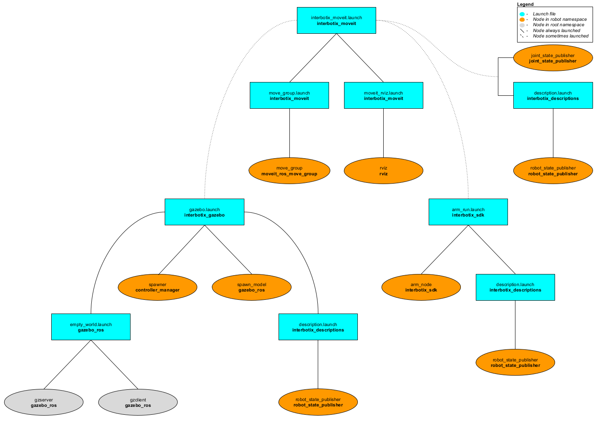

# interbotix_moveit

## Overview
This package contains the necessary config files to get any of the many Interbotix X-Series arms working with MoveIt. Originally, the MoveIt Setup Assistant wizard was used to generate a MoveIt package for each robot individually. The packages were then all merged into one and the launch files modified so that an argument specifying the 'robot_name' could be passed down to load the right config files (specifically the SRDFs). Additionally, this package makes use of the FollowJointTrajectory interface which seems to work pretty well in both Gazebo and on the physical robot. A 'master' launch file was then written to allow a user to choose whether to have MoveIt work with the simulated version, the physical robot hardware, or a MoveIt generated fake robot.

## Structure

As shown above, this package builds on top of the *interbotix_gazebo*, *interbotix_sdk*, and *interbotix_descriptions* packages. To get familiar with those packages, please refer to their respective READMEs. Regarding the MoveIt specific nodes, they are described below:
- **move_group** - responsible for planning the trajectories needed to achieve a particular arm/gripper pose
- **rviz** - responsible for showing the robot model and including the MoveIt MotionPlanning plugin

## Usage
To run this package on the physical robot, type the line below in a terminal (assuming the PincherX 100 is being launched).
```
$ roslaunch interbotix_moveit interbotix_moveit.launch robot_name:=px100 use_actual:=true dof:=4
```
If running this package on a Gazebo simulated robot, type the line below in a terminal (assuming the ReactorX 200 is being launched). Don't forget to unpause the Gazebo physics afterwards or MoveIt will never load!
```
$ roslaunch interbotix_moveit interbotix_moveit.launch robot_name:=rx200 use_gazebo:=true
```
If running this package on a MoveIt generated fake robot, type the line below in a terminal (assuming the WidowX 250 is being launched).
```
$ roslaunch interbotix_moveit interbotix_moveit.launch robot_name:=wx250 use_fake:=true
```
This is the bare minimum needed to get up and running. Take a look at the table below to see how to further customize with other launch file arguments.

| Argument | Description | Default Value |
| -------- | ----------- | :-----------: |
| robot_name | name of a robot (ex. 'wx200') | "" |
| use_gazebo | launch MoveIt with a Gazebo simulated robot | false |
| use_actual | launch MoveIt with the physical robot | false |
| use_fake | launch MoveIt with a MoveIt generated fake robot | false |
| arm_operating_mode | if using the physical robot, set this to either "position" or "velocity" to let the *interbotix_sdk* node know whether to command the joint positions or velocities from the MoveIt JointTrajectory to the motors | position |
| arm_profile_velocity | register value describing the max velocity limit for the robot joints (excluding gripper); refer to the register description [here](http://emanual.robotis.com/docs/en/dxl/x/xm430-w350/#profile-velocity112). If doing 'position' control, setting this to '131' would be equivalent to a limit of 3.14 rad/s. To have an 'infinite' max limit, set this to '0' | 131 |
| arm_profile_acceleration | register value describing the max acceleration limit for the robot joints (excluding gripper); refer to the register description [here](http://emanual.robotis.com/docs/en/dxl/x/xm430-w350/#profile-acceleration108). If doing 'position' or 'velocity' control, setting this to '15' seems to give smooth but quick movement. To get very fast motion, set this to '0' | 15 |
| use_world_frame | set this to 'true' if you would like to load a 'world' frame to the 'robot_description' parameter which is located exactly at the 'base_link' frame of the robot; if using multiple robots or if you would like to attach the 'base_link' frame of the robot to a different frame, set this to False | true |  
| use_pid_cntlrs | set this to 'true' if you  would like to run PID controllers to make the motors better track the desired states when running the actual robot. Note that the 'arm_operating_mode' must be set to 'velocity' for this to work | false |
| dof | the degrees of freedom of the arm; while the majority of the arms have 5 dof, others have 4 or 6 dof | 5 |

## Notes
Once the MoveIt GUI is fully loaded, take a look at the available planning groups. There should be two of them - one called 'interbotix_arm' and the other called 'interbotix_gripper'. The 'interbotix_arm' group contains the joints needed to plan the trajectories for the whole arm (excluding the gripper) while the 'interbotix_gripper' group contains the joints needed to plan the trajectories for the gripper (based on the linear distance from the 'right_finger_link' to the 'fingers_link'). There are a few saved poses for each of these groups that be executed such as 'home', 'sleep', and 'upright' poses for the 'interbotix_arm' group, and 'open', 'close', and 'home' for the 'interbotix_gripper' group ('home' just moves the gripper such that the angular position of the motor is at 0 radians). Also, it should be noted that the gripper frame of reference is located at the 'ee_arm_link'.

Additionally, by default, the MoveIt GUI does not display the green or orange robots that represent the start and goal states for the arm respectively. To display them, navigate to the *MotionPlanning* -> *Planning Request* dropdown in Rviz and check the *Query Start State* and *Query Goal State* checkboxes.
